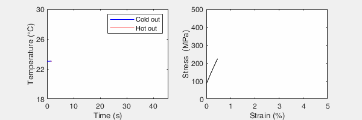

<h3><a href="./"> back to home page</a></h3>

* * *

## Elastocaloric refrigeration

  

<a href="assets/img/elastogif_large.gif" data-lightbox="image-1" data-title="(Left) Water is used to exchange heat between the Nitinol and hot/cold reservoirs. These data show the temperature of the cold and hot water outlets. I have achieved much colder temperatures than shown here from, e.g., regeneration. (Right) This is the stress-strain data on the Nitinol wire during loading (upper plateau) and unloading (lower plateau). When loading, the Nitinol heats up and water is used to pump heat away (see left). Now at room temperature but in a strained state, the Nitinol is unloaded and becomes cold. The 'cold' is then pumped away to a cold reservoir or regenerator."></a>
