Hi! I am a mechanical engineer at Cornell University.

I will graduate with a PhD in 2019. I'm looking for interesting new projects to pursue - please contact me with opportunities at <u>rjs492@cornell.edu</u>

I hope the following information gives you a better idea of how I am qualified for a variety of engineering projects. I've tried to include descriptions on each image - just click on them!

 

<h2>I love building things!</h2>

 

<h3>Some things I've built:</h3>
At Cornell, I was fortunate enough to be awarded a NSF Graduate Research Fellowship, which gave me the flexibility to research a variety of interesting topics. Generally, my research has focused on <u>thermal systems</u>. Click on the images below for more information on each of my recent projects.

<a href="/tiny">Solar thermal diagnostic system (TINY) 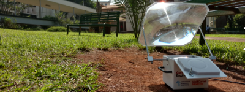</a>

<a href="/elastocaloric">Elastocaloric refrigerator 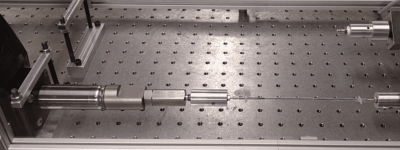</a>

<a href="/sma">Heat-driven shape memory actuators 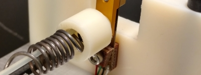</a>

 
 

<h3>Some places I've worked:</h3>
I have a variety of professional experiences, both in industry and at universities. <u>I am a talented engineer and an adept research scientist</u>.

I worked with robotics at both Honda and Dow AgroSciences. It's harder for me to showcase my work from this topic because of IP limitations; however, I'd be happy to discuss my expertise in this field. I have experience with Motoman and EPSON 6-axis robots, vision algorithms for control, and process control for manufacturing.

<h4>
<ul>
  <li>Honda Engineering North America</li>
  <li>Dow AgroSciences</li>
  <li>Cornell University</li>
  <li>IMTEK, University of Freiburg, Baden-Württemberg, Germany</li>
  <li>Ohio State University</li>
</ul>
</h4>
 

<h3>Some of my talents:</h3>

<table class="talenttable">
  <tr>
    <td>
      <a href="assets/img/Crosssection.PNG" data-lightbox="image-1" data-title="Test caption">Mechanical design 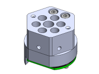</a>
    </td>
    <td>
      <a href="assets/img/Manufacturing1.jpg" data-lightbox="image-1" data-title="Test caption">Manufacturing 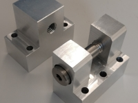</a>
    </td>
  </tr>
  <tr>
    <td>
      <a href="assets/img/Program.PNG" data-lightbox="image-1" data-title="Test caption">Programming 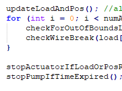</a>
    </td>
    <td>
      <a href="assets/img/PCB.PNG" data-lightbox="image-1" data-title="Test caption">Electronics 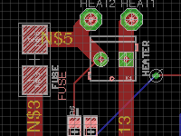</a>
    </td>
  </tr>
  <tr>
    <td>
      <a href="assets/img/Thermal.png" data-lightbox="image-1" data-title="Test caption">Thermal systems 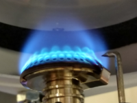</a>
    </td>
    <td>
      <a href="assets/img/Mechsim.png" data-lightbox="image-1" data-title="Test caption">Mechanical simulation 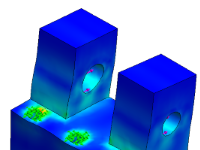</a>
    </td>
  </tr>
  <tr>
    <td>
      <a href="assets/img/Thermalsim.png" data-lightbox="image-1" data-title="Test caption">Thermal simulation 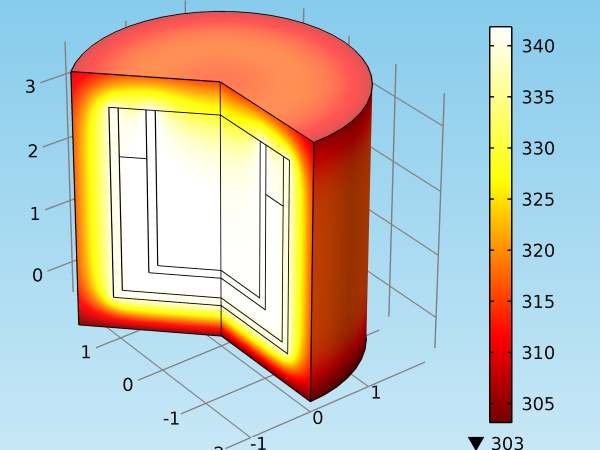</a>
    </td>
    <td>
      <a href="assets/img/Sensors.jpg" data-lightbox="image-1" data-title="Test caption">Sensors 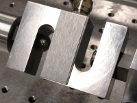</a>
    </td>
  </tr>
  <tr>
    <td>
      <a href="assets/img/Robotics.jpg" data-lightbox="image-1" data-title="Test caption">Robotic systems 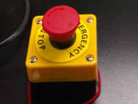</a>
    </td>
    <td>
      <a href="assets/img/Optics.PNG" data-lightbox="image-1" data-title="Test caption">Optics 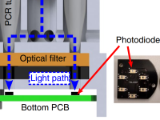</a>
    </td>
  </tr>
  <tr>
    <td>
      <a href="assets/img/Publication.PNG" data-lightbox="image-1" data-title="Test caption">Publishing my work 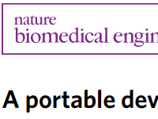</a>
    </td>
    <td>
      <a href="assets/img/Deployed.jpg" data-lightbox="image-1" data-title="Test caption">Deploying my work 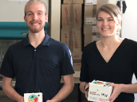</a>
    </td>
  </tr>
</table>

 

<h3>Some of my interests (incomplete list):</h3>

<ul>
  <li>Energy</li>
  <li>Refrigeration (especially solid state)</li>
  <li>Automation</li>
  <li>Actuators (especially shape memory)</li>
  <li>Portable devices</li>
  <li>Design and manufacturing (both mechanical/electrical)</li>
  <li>Sensors/measurement</li>
  <li>Mechanisms</li>
  <li><i>Any engineering topic that is cutting-edge, unusual, innovative </i></li>
</ul>
 

<h3>Some of my hobbies:</h3>

I am a very self-motivated individual, and my work is important to me. It's easy for me to do my work because it's fun! However, I also have a variety of hobbies, and I value a balanced lifestyle.

<ul>
  <li>Camping</li>
  <li>Hiking</li>
  <li>Basketball</li>
  <li>Running</li>
  <li>Rock climbing</li>
</ul>

  <a href="assets/img/Canoe.jpg" data-lightbox="image-1" data-title="Test caption">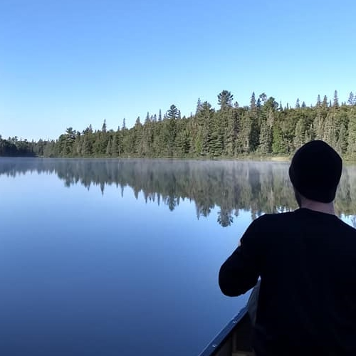</a>
  &nbsp;
  <a href="assets/img/Paul.jpg" data-lightbox="image-1" data-title="Test caption">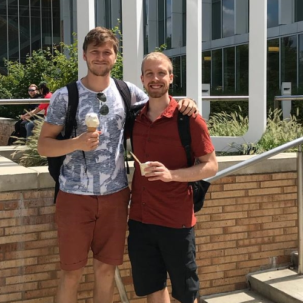</a>
  &nbsp;
  <a href="assets/img/Basketball.jpg" data-lightbox="image-1" data-title="Test caption">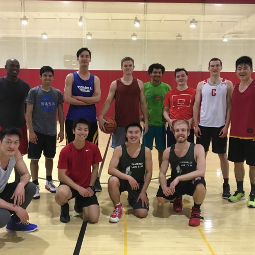</a>

