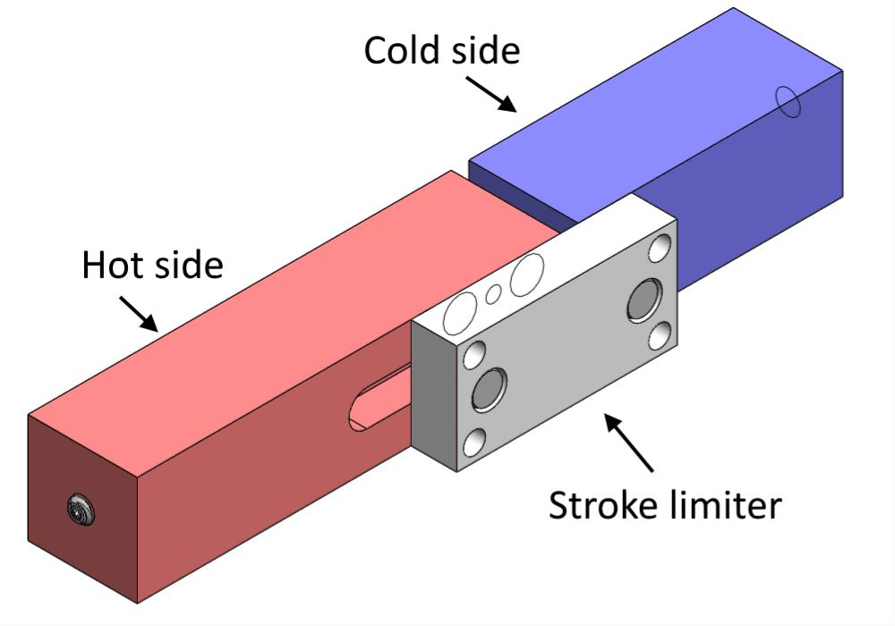
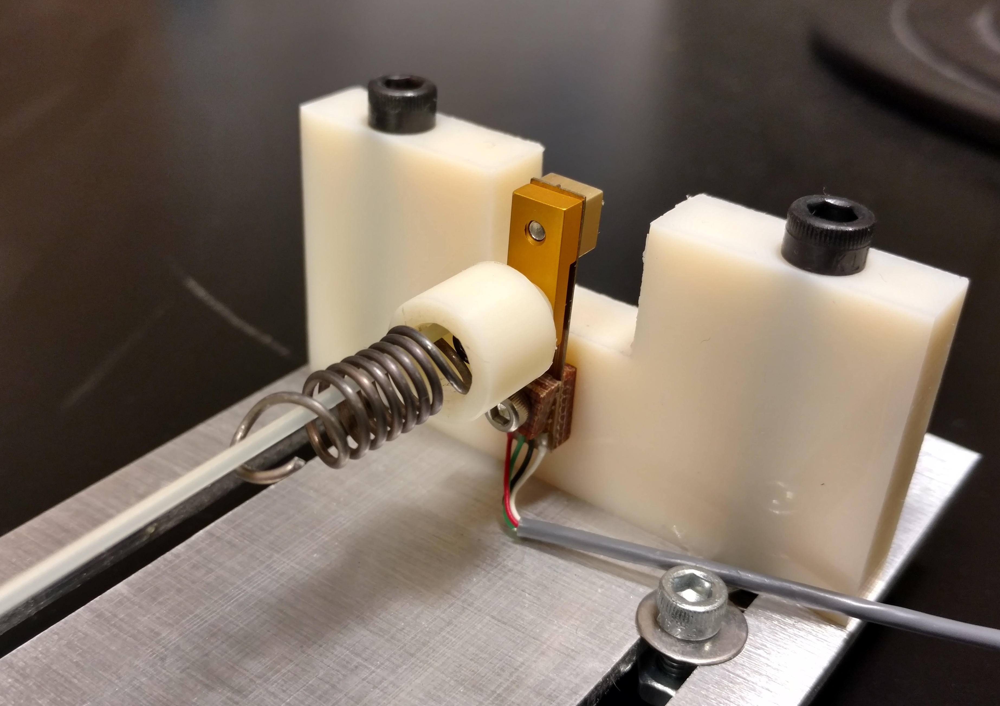

<h3><a href="./"> back to home page</a></h3>
 
* * *

## Shape memory alloy actuators

Shape memory alloys such as Nitinol (NiTi) can be "programmed" to express different shapes at different temperatures. The shape memory effect is a result of a change in crystal structure, and can be used for reversible mechanical actuation. For example, a shape memory alloy spring can be paired with a steel bias spring. Normally the bias spring is much stronger than the Nitinol spring, but temperature changes can cause the Nitinol spring to become much stronger than the bias spring.

<a href="assets/img/actuatorgif.gif" data-lightbox="image-1" data-title="This is a model of my heat-driven actuator. A Nitinol spring is initially in a cold reservoir and is pulled towards the hot reservoir by a relatively strong steel spring. Now in the hot reservoir, the Nitinol spring begins to heat up and becomes much more stiff, returning it to the cold reservoir. Spring plungers are used to limit the stroke of the actuation and to lock the springs in place during heating/cooling, making the motion more binary."></a>

I can't talk about my application for this actuator at this time because IP is yet to be filed; however, the work will be published in 2019.

